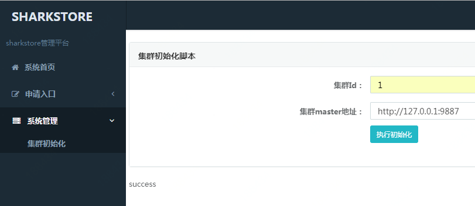
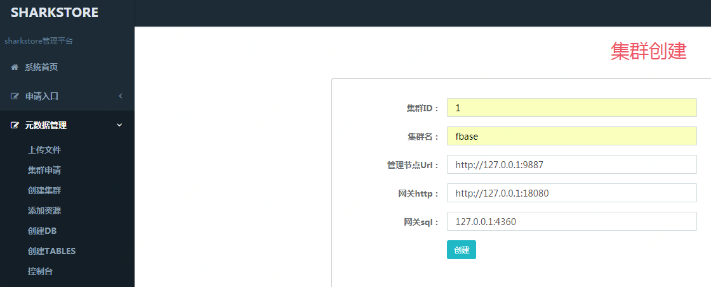
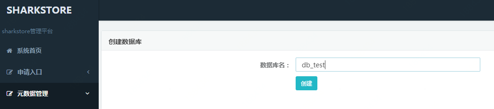
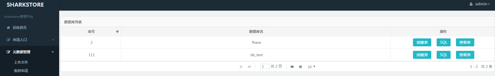
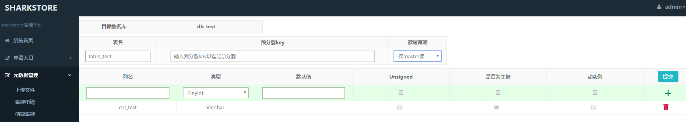
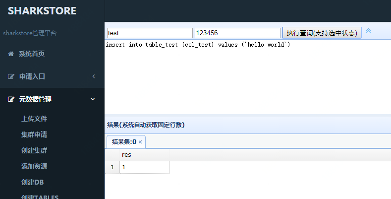
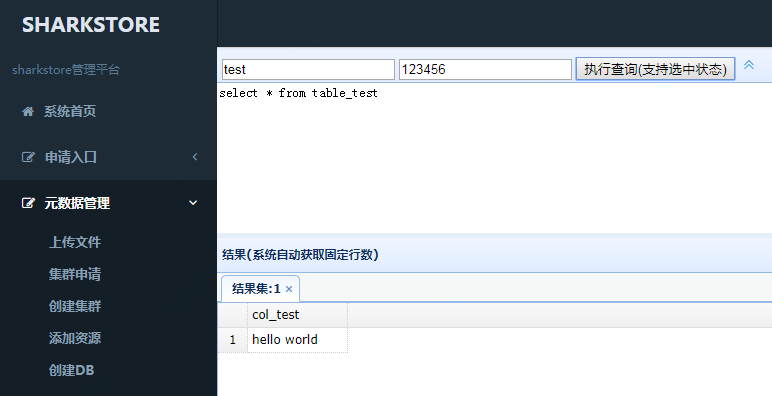

# 编译
master-server,gateway-server，console这3个sharkstore组件是由go语言编写的，
各组件目录结构类似，main函数分别存在各组件目录的cmd下。<br>
data-server是由c++编写的，目录结构和go语言组件不同。下面分别描述下编译各组件的命令：<br>
## 编译master-server：
```
cd sharkstore/master-server/cmd && sh ./build.sh
```
## 编译gateway-server：

```
cd sharkstore/proxy/gateway-server/cmd && sh ./build.sh
```
## 编译console：

```
cd sharkstore/console/cmd && sh ./build.sh
```


## 编译data-server：
编译前，首先安装data-server依赖，详细查看data-server目录中[INSTALL.md](data-server/INSTALL.md)，<br>
依赖安装之后执行下面命令进行编译：<br>

```
mkdir build && cd build
cmake ..
make -j 4
```


# 配置
使用下面的配置可以快速完成sharkstore在本地的环境搭建：<br>

```
mkdir -p sharkstore/bin/{ms,gw,cs,ds}
cp sharkstore/master-server/cmd/master-server sharkstore/bin/ms
cp sharkstore/proxy/gateway-server/cmd/gateway-server sharkstore/bin/gw
cp sharkstore/console/cmd/sharkstore-console sharkstore/bin/cs
```

## 配置master-server：
在sharkstore/bin/ms目录中创建如下配置ms.conf<br>

```
touch sharkstore/bin/ms/ms.conf
```

> #MS Configuration.
> node-id = 1<br>
> name = "ms"<br>
> #process role is master or metric
> role = "master"<br>
> version = "v1"<br>
> #secret key for master, leaves it empty will ignore http request signature verification
> secret-key = "test"<br>
> 
> #cluster meta data store path<br>
> data-dir = "sharkstore/bin/ms/data"<br>
> 
> [cluster]<br>
> cluster-id = 1<br>
> 
> [[cluster.peer]]<br>
> id = 1<br>
> host = "127.0.0.1"<br>
> http-port = 9887<br>
> rpc-port = 38887<br>
> raft-ports = [9877,9867]<br>
>                                                    
> [raft]<br>                                 
> heartbeat-interval = "500ms"<br>                  
> retain-logs-count = 100<br>
> 
> [log]<br>
> dir = "sharkstore/bin/ms/log"<br>
> module = "master"<br>
> level = "debug"<br>
> 
> [metric]<br>
> interval = "15s"<br>
> address = ""<br>
> 
> [schedule]<br>
> max-snapshot-count = 10000000<br>
> max-node-down-time = "1h"<br>
> leader-schedule-limit = 64<br>
> region-schedule-limit = 120<br>
> replica-schedule-limit = 120<br>
> max-task-timeout = "300s"<br>
> max-range-down-time = "360s"<br>
> node-range-balance-time = "120s"<br>
> storage-available-threshold = 25<br>
> 
> [replication]<br>
> max-replicas = 1<br>
> location-labels = []<br>

## 配置gateway：
在sharkstore/bin/gw目录中创建如下配置gw.conf<br>

```
touch sharkstore/bin/gw/gw.conf
```

> #GS Configuration.
> http-port = 18080<br>
> lock-port = 18090<br>
> mysql-port = 4360<br>
> max-clients = 10000<br>
> max-record-limit = 10000<br>
> user = "test"<br>
> password = "123456"<br>
> charset = "utf8"<br>

> [performance]<br>
> max-work-num = 100<br>
> #task queue size<br>
> max-task-queue-len = 10000<br>
> #keep connect size for each ds<br>
> grpc-pool-size = 10<br>
> #128 KB<br>
> grpc-win-size = 131072<br>
> slow-insert = "20ms"<br>
> slow-select = "100ms"<br>
> slow-delete = "20ms"<br>

> [cluster]<br>
> id = 1<br>
> address = ["127.0.0.1:38887"]<br>
> token = "test"<br>

> [log]<br>
> dir = "./log"<br>
> module = "gateway"<br>
> level = "debug"<br>

> [metric]<br>
> interval = "15s"<br>
> address = ""<br>

## 配置console
在sharkstore/bin/cs目录中创建如下配置cs.conf<br>

```
touch sharkstore/bin/cs/cs.conf
```

> project.home.dir=sharkstore/console<br>
> 
> http.port=10081<br>
> 
> #gin framework<br>
> gin.log.file=./gin.log<br>
> #debug, release, test<br>
> gin.mode=debug<br>
> 
> #gateway mysql api<br>
> mysql.host=127.0.0.1<br>
> mysql.port=4360<br>
> mysql.user=test<br>
> mysql.passwd=123456<br>
> 
> #log<br>
> log.dir = ./logs<br>
> log.module= console<br>
> log.level = warn<br>
> 
> #grafana monitor domain<br>
> monitor.domain = http://sharkstore.grafana.com<br>
> 
> #online<br>
> app.name = source<br>
> app.token = 123456789<br>
> app.domain.name = test.sharkstore.console.com<br>
> app.address = http://test.sharkstore.console.com:10081<br>
> 
> lock.cluster.id=1<br>

## 配置data-server
在sharkstore/bin/ds目录中创建如下配置ds.conf<br>

```
touch sharkstore/bin/ds/ds.conf
```
> base_path = sharkstore/bin/ds<br>
> [rocksdb]<br>
> <br>
> #rocksdb path<br>
> path = sharkstore/bin/ds/db<br>
> <br>
> #rocksdb block cache size, default 1024MB, max uint: MB<br>
> block_cache_size = 10240MB<br>
> <br>
> #time unit: ms<br>
> #set task defaul timeout if request is not<br>
> #default value is 3000 ms<br>
> task_timeout = 3000<br>
> <br>
> #thread stack size, should >= 64KB<br>
> #default value is 64KB<br>
> thread_stack_size = 256KB<br>
> <br>
> #unix group name to run this program,<br>
> #not set (empty) means run by the group of current user<br>
> run_by_group =<br>
> <br>
> #unix username to run this program,<br>
> #not set (empty) means run by current user<br>
> run_by_user =<br>
> <br>
> [heartbeat]<br>
> <br>
> #master's ip_addr and port<br>
> #may be multiple different master<br>
> master_host = 127.0.0.1:38887<br>
> <br>
> #the number of the above master_host<br>
> master_num = 1<br>
> <br>
> #time unit: s<br>
> #default value is 10 ms<br>
> node_heartbeat_interval = 10<br>
> <br>
> #time unit: s<br>
> #default value is 10 s<br>
> range_heartbeat_interval = 10<br>
> <br>
> <br>
> [log]<br>
> <br>
> #if log path is not set then use base_path<br>
> #log path = $log_path + /logs<br>
> log_path= sharkstore/bin/ds<br>
> <br>
> #sync log buff to disk every interval seconds<br>
> #default value is 10 seconds<br>
> sync_log_buff_interval = 10<br>
> <br>
> #if rotate the error log every day<br>
> #default value is false<br>
> rotate_error_log = true<br>
> <br>
> #keep days of the log files<br>
> #0 means do not delete old log files<br>
> #default value is 0<br>
> log_file_keep_days = 7<br>
> <br>
> #standard log level as syslog, case insensitive, value list:<br>
> ###emerg for emergency<br>
> ###alert<br>
> ###crit for critical<br>
> ###error<br>
> ###warn for warning<br>
> ###notice<br>
> ###info<br>
> ###debug<br>
> log_level=debug<br>
> <br>
> [socket]<br>
> #connect timeout in seconds<br>
> #default value is 30s<br>
> connect_timeout = 3<br>
> <br>
> #network timeout in seconds<br>
> #default value is 30s<br>
> network_timeout = 30<br>
> <br>
> #epoll wait timeout<br>
> #default value is 30ms<br>
> epoll_timeout = 30<br>
> <br>
> #socket keep time<br>
> #default value is 30m<br>
> socket_keep_time = 1800<br>
> <br>
> #max concurrent connections this server supported<br>
> #default value is 256<br>
> max_connections = 100000<br>
> <br>
> #default value is 16K<br>
> max_pkg_size = 256KB<br>
> <br>
> #default value is 64KB<br>
> min_buff_size = 16KB<br>
> <br>
> #default value is 64KB<br>
> max_buff_size = 256KB<br>
> <br>
> <br>
> [worker]<br>
> <br>
> #ip_addr = 127.0.0.1<br>
> <br>
> #listen port of recv data<br>
> port = 7180<br>
> <br>
> #socket accept thread number<br>
> #default value is 1<br>
> accept_threads = 1<br>
> <br>
> #epoll recv event thread number<br>
> #no default value and must be configured<br>
> event_recv_threads = 4<br>
> <br>
> #epoll send event thread number<br>
> #no default value and must be configured<br>
> event_send_threads = 2<br>
> <br>
> #thread only handle fast tasks. eg. RawGet<br>
> fast_worker = 4<br>
> <br>
> #thread only handle slow tasks. eg. select<br>
> slow_worker = 8<br>
> <br>
> #max count of recv worker pkg<br>
> max_recv_pkg = 10000000<br>
> <br>
> <br>
> [manager]<br>
> <br>
> #ip_addr = 127.0.0.1<br>
> <br>
> #listen port of recv data<br>
> port = 26180<br>
> <br>
> #socket accept thread number<br>
> #default value is 1<br>
> accept_threads = 1<br>
> <br>
> #epoll recv event thread number<br>
> #no default value and must be configured<br>
> event_recv_threads = 1<br>
> <br>
> #epoll send event thread number<br>
> #no default value and must be configured<br>
> event_send_threads = 1<br>
> <br>
> #the number of threads dealing with the recved queue<br>
> #no default value and must be configured<br>
> worker_threads = 2<br>
> <br>
> #max count of recv manager pkg<br>
> max_recv_pkg = 1000<br>
> <br>
> [range]<br>
> <br>
> #the range real_size is calculated<br>
> #if statis_size is greater than check_size<br>
> #default value is 32MB<br>
> check_size = 32MB<br>
> <br>
> #range split threshold<br>
> #default value is 64MB<br>
> split_size = 64MB<br>
> <br>
> #default value is 128MB<br>
> max_size = 128MB<br>
> <br>
> #range real size statis thread num<br>
> worker_threads = 1<br>
> <br>
> #0 sql, 1 redis, default=0<br>
> access_mode = 0<br>
> <br>
> [raft]<br>
> <br>
> #ports used by the raft protocol<br>
> port = 48887<br>
> <br>
> #raft log path<br>
> log_path = sharkstore/bin/ds/raft<br>
> <br>
> #log_file_size = 16777216<br>
> #max_log_files = 5<br>
> <br>
> #consensus_threads = 4<br>
> #consensus_queue = 100000<br>
> <br>
> #apply_threads = 4<br>
> #apply_queue = 100000<br>
> <br>
> #grpc_send_threads = 4<br>
> #grpc_recv_threads = 4<br>
> <br>
> <br>
> [metric]<br>
> #metric report ip<br>
> ip_addr = <br>
> <br>
> #metric report port<br>
> port = 9887<br>
> <br>
> #epoll send event thread number<br>
> #no default value and must be configured<br>
> event_send_threads = 1<br>
> <br>
> max_recv_pkg = 10<br>
> <br>
> #metric report interval<br>
> #default value is 60s<br>
> interval = 60<br>
> <br>
> #which cluster to belong to<br>
> cluster_id = 1;<br>
> <br>
> #metric report name_space<br>
> name_space = ds<br>
> <br>
> #metric report uri<br>
> uri = /metric/tcp/process<br>
> <br>
> [client]<br>
> <br>
> ip_addr = <br>
> port = 7180<br>
> <br>
> event_recv_threads = 1<br>
> event_send_threads = 1<br>
> worker_threads = 0<br>
> <br>
> #max count of recv manager pkg<br>
> max_recv_pkg = 10000000<br>


# 启动
## 启动master-server：

```
cd sharkstore/bin/ms
setsid ./master-server -config=ms.conf &
```
## 启动gateway-server:

```
cd sharkstore/bin/gw
setsid ./gateway-server -config=gw.conf &
```
## 启动console：

```
cd sharkstore/bin/cs
setsid ./sharkstore-console -config=cs.conf &
```
## 启动data-server:

```
cd sharkstore/bin/ds
./data-server ds.conf
```

# 环境创建
## 初始化
访问console的域名http://test.sharkstore.console.com:10081，<br>
在左边导航选择"集群初始化"，并填写master-server中相应的集群id和http服务地址:<br>
<br>

重新登录管理界面：<br>
<br>

## 创建集群
选择左边导航中的"元数据管理"->"创建集群"，并填写gateway http服务地址和sql服务地址：<br>
<br>

创建成功后，可以在"系统首页"查看到所有集群，并且可以在"元数据"中创建该集群的库和表：<br>
<br>

## 创建库
选择集群"元数据"->"创建db"，并填写库名（例：db_test），：<br>
<br>
<br>

## 创建表
选择"创建表"，并填写表名（例：table_test）和表结构（例：col_test）：<br>
<br>
<br>

## sql读写
在“集群首页”查看创建的集群，选择“查看集群”:<br>
<br>

进入“控制台”执行简单的sql命令：<br>
<br>

输入gateway-server的用户和密码，并写入一条记录:<br>
<br>

读取记录:<br>
<br>


# API
用户可以通过访问gateway-server来读写创建的表，<br>
gateway-server提供sql和rest接口，详细查看[sql接口](doc/sql_api.md)和[http接口](doc/http_api.md)。<br>

